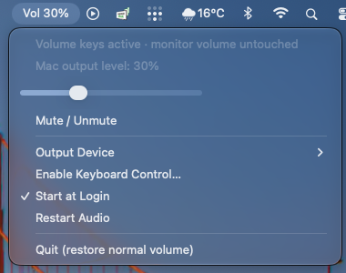

# MonitorKeys

Volume keys for HDMI and DisplayPort monitors on Apple Silicon Macs.

When a Mac sends audio to a monitor over HDMI or DisplayPort, macOS greys out the
volume slider and the keyboard volume keys stop working. MonitorKeys is a tiny menu
bar helper that gives you back **volume up / down / mute on the keyboard**, without
touching the monitor's own settings and without installing any drivers or third-party
frameworks.



- Single 100 KB app, built from three source files with the tools that ship with Xcode.
- No kernel extensions, no virtual audio drivers, no Homebrew, no admin rights.
- Audio is scaled in memory and sent to the same monitor. Nothing is recorded or transmitted.
- Automatically routes sound to the monitor when it is plugged in, and starts at login.

## How it works

macOS 14.2 added [Core Audio process taps](https://developer.apple.com/documentation/CoreAudio/capturing-system-audio-with-core-audio-taps),
which let an app read the system's audio stream. MonitorKeys creates a private tap on
the monitor's output, multiplies the samples by your chosen level, and writes them
back to the monitor through a private aggregate device. While the tap is active the
original stream is muted, so you hear only the scaled copy. Quit the app and the
normal, unscaled audio returns instantly.

The keyboard volume keys are captured with a session-level event tap and consumed, so
macOS no longer shows its "volume not available" overlay for them. When you switch
the output back to the built-in speakers, MonitorKeys steps aside and the keys behave
normally again.

The DDC/CI route (sending commands to the monitor over the video cable, which apps
like MonitorControl use) is not used: many HDMI adapters and display pipelines on
Apple Silicon do not pass DDC through, and this approach works regardless.

## Requirements

- Apple Silicon Mac running macOS 14.2 or later.
- Xcode Command Line Tools (`xcode-select --install`) to build.
- A monitor connected over HDMI or DisplayPort that macOS lists as an audio output.

## Install

### Homebrew

```sh
brew install --cask mevlut-geredeli/tap/monitorkeys
```

The cask builds the app from source on your Mac (Xcode Command Line Tools required)
and installs it to `/Applications`. Upgrade with `brew upgrade --cask monitorkeys`;
remove with `brew uninstall --cask monitorkeys` (add `--zap` to delete its settings too).

Homebrew build steps cannot see your keychain, so the app is ad-hoc signed and macOS
asks for the Accessibility permission again after each upgrade. To avoid that, create
the local signing identity once (see below) and re-sign after upgrading:

```sh
codesign --force --sign "MonitorKeys Local Signing" /Applications/MonitorKeys.app
```

### From source

```sh
git clone https://github.com/mevlut-geredeli/MonitorKeys.git
cd MonitorKeys
sh install.sh
```

`install.sh` builds the app, runs its self-test, copies it to `~/Applications` and
launches it.

### Permissions

Either way, grant two permissions once:

1. **System audio recording** — macOS shows this prompt on first launch. It is what
   lets the app read and re-emit the audio stream. Approve it.
2. **Accessibility** — needed to capture the volume keys. Click the menu bar item
   (it reads `Vol 100%`) → **Enable Keyboard Control…**, then turn on MonitorKeys in
   *System Settings → Privacy & Security → Accessibility*. The keys start working
   within a second; no restart needed.

Without the Accessibility permission the app still works through the slider in its
menu.

### Keep permissions across rebuilds (recommended if you plan to edit the code)

macOS ties privacy permissions to an app's code signature. With the default ad-hoc
signature every rebuild produces a new signature and the permissions have to be
granted again. To avoid that, create a local self-signed signing identity once:

```sh
sh scripts/make-signing-identity.sh   # asks for your login password once
sh install.sh
```

`build.sh` picks the identity up automatically. Nothing leaves your Mac; the
certificate only exists in your login keychain.

## Usage

| Action | Effect |
|---|---|
| Volume up / down keys | Change the Mac's output level in 5 % steps (configurable) |
| Mute key | Toggle between silence and the previous level |
| Menu bar item | Shows the current level (`Vol 65%`, `Muted`) and a slider |
| Output Device submenu | Pick which monitor to manage, or leave it on *Automatic* |
| Start at Login | On by default; toggle here or in *System Settings → General → Login Items* |
| Quit | Stops processing and restores the normal, unscaled audio |

100 % is the normal level you had without the app; there is no amplification.

**Automatic output switching:** whenever the managed monitor appears as an audio
device (cable plugged in, wake from sleep, login), MonitorKeys selects it as the
sound output. If you deliberately switch to the built-in speakers while the monitor
stays connected, that choice is respected until the monitor is unplugged and
reconnected.

## Configuration

Settings are stored per user in `defaults` and never in this repository.

```sh
# Manage a specific monitor instead of the first HDMI/DisplayPort output found
defaults write com.mevlutgeredeli.MonitorKeys outputDevice "VX3276-QHD"

# Back to automatic
defaults delete com.mevlutgeredeli.MonitorKeys outputDevice

# Volume step per key press, in percent (default 5)
defaults write com.mevlutgeredeli.MonitorKeys step 10

# Do not start at login (same as the menu toggle)
defaults write com.mevlutgeredeli.MonitorKeys loginItem -bool false
```

The *Output Device* submenu writes the same `outputDevice` setting. Restart the app
after changing `step`.

## Diagnostics

Launch with logging to see what the app is doing:

```sh
open -n ~/Applications/MonitorKeys.app --stderr /tmp/MonitorKeys.log
kill -USR1 $(pgrep -x MonitorKeys)   # append a status line to the log
kill -USR2 $(pgrep -x MonitorKeys)   # open the Accessibility permission prompt
tail -f /tmp/MonitorKeys.log
```

A status line looks like this:

```
MonitorKeys: status="Volume keys active · monitor volume untouched" target="VX3276-QHD"
running=true level=30 callbacks=1547 inputPeak=0.0635 outputPeak=0.0190
accessibility=true keyboardTap=true loginItem=true
```

`callbacks` only advances while something is playing; `0` at idle is normal.
`outputPeak / inputPeak` should equal `level / 100`.

## Troubleshooting

- **Keys do the macOS thing (overlay with a crossed-out speaker):** Accessibility
  permission is missing or stale. If you rebuilt the app without a signing identity,
  reset and re-grant it:
  `tccutil reset Accessibility com.mevlutgeredeli.MonitorKeys`, then
  *Enable Keyboard Control…* from the menu.
- **"No HDMI or DisplayPort output found":** macOS does not see your monitor as an
  audio device. Check *System Settings → Sound → Output*; if it is listed under
  another transport type, pin it by name with the `outputDevice` setting.
- **"Audio failed: …":** the menu shows the raw Core Audio error. The usual cause is a
  denied system audio permission; look under *Privacy & Security → Screen & System
  Audio Recording*, then use *Restart Audio*.
- **Two copies in Login Items after changing the bundle identifier:** remove the
  stale one in *System Settings → General → Login Items*.
- Run only one copy of the app while testing.

## Limitations

- Stereo Float32 outputs only, which covers HDMI and DisplayPort audio on Apple Silicon.
- The audio path also works inside the App Sandbox (with the `audio-input`
  entitlement), so a Mac App Store build is feasible.
- Audio the system refuses to tap (some DRM-protected playback) is passed through unscaled.
- The greyed-out slider in System Settings stays greyed out; the level lives in the
  MonitorKeys menu.
- Apple Silicon only. The build targets `arm64`; the tap API itself is available on
  Intel Macs running macOS 14.2+, so porting is a matter of the build flags.

## Uninstall

Quit MonitorKeys from its menu, then:

```sh
rm -rf ~/Applications/MonitorKeys.app
defaults delete com.mevlutgeredeli.MonitorKeys
tccutil reset Accessibility com.mevlutgeredeli.MonitorKeys
```

The login item disappears with the app. If you created the signing identity, delete
"MonitorKeys Local Signing" in Keychain Access.

## Building and testing

```sh
sh build.sh
build/MonitorKeys.app/Contents/MacOS/MonitorKeys --self-test
```

- `main.swift` — menu bar UI, volume keys, device selection, output switching, sleep/wake.
- `AudioEngine.m` — Core Audio tap → gain → output. The real-time callback takes no
  locks and does no allocation, logging or I/O. Level changes are ramped to avoid clicks.
- `AudioEngine.h` — the small C interface between the two.

## License

[MIT](LICENSE)
